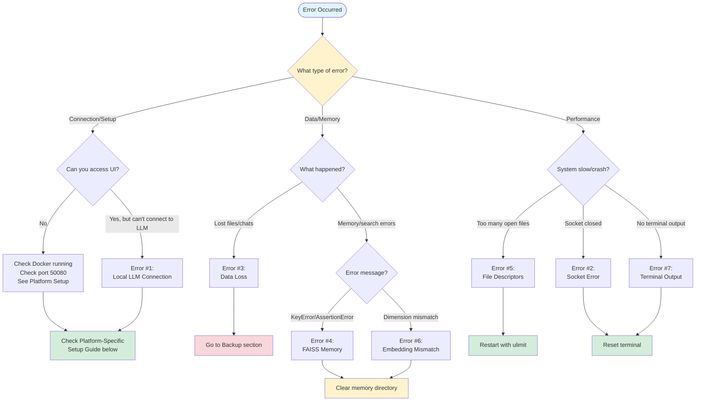

# Agent Zero: Beginner's Guide to Common Errors

**Last Updated:** January 21, 2026  
**Agent Zero Version:** v0.9.7 (November 2024)  
**Target Audience:** Non-expert beginners using self-hosted Agent Zero on Windows/Linux/macOS

---

## ⚠️ Version Scope Notice

This guide reflects observed behavior in **Agent Zero v0.9.7** as of January 2026. Implementation details (model names, vector memory backend, terminal handling) may change in future releases. When behavior differs from this guide, prefer:

1. Built-in UI tools and features
2. Official [release notes](https://github.com/agent0ai/agent-zero/releases)
3. [Official documentation](https://github.com/agent0ai/agent-zero/tree/main/docs)

**Model names** (llama3.2, mxbai-embed-large) are examples and may change. Always verify with `ollama list` and copy exact names.

---

## 🎯 Quick Start: Understanding This Guide

This guide compiles the **most persistent, unresolved errors** reported by 5+ users across multiple sources (GitHub, forums, Discord) over the past 3 months. Each error includes:

- **Clear description** in plain language
- **Why it happens** (root causes)
- **How to fix it** (step-by-step)
- **What NOT to do** (common mistakes)
- **How to prevent it** (best practices)

**Important:** Agent Zero is under active development. Some issues may be resolved in future versions.

---

## 🔍 Quick Symptom Finder

**See an error message? Find your solution fast:**

| What You See | Jump To Section |
|-------------|-----------------|
| `Cannot connect to host` / `Connection timeout` / `litellm.APIConnectionError` | [#1 Local LLM Connection](#1-local-llm-connection-failures) |
| `OSError: Socket is closed` / Agent unresponsive | [#2 Socket Closed Error](#2-socket-closed-error) |
| Chat history disappeared / Files missing / Corrupted backup | [#3 Data Loss](#3-data-loss-on-crashrestart) |
| `KeyError` / `AssertionError: d == self.d` / `InvalidKeyException` | [#4 Memory FAISS Errors](#4-memory-system-faiss-errors) |
| `OSError: [Errno 24] Too many open files` | [#5 File Descriptor Exhaustion](#5-file-descriptor-exhaustion) |
| `Dimension mismatch` / Vector search fails | [#6 Embedding Model Mismatch](#6-embedding-model-mismatch) |
| Commands run but no output / "No output returned" | [#7 Terminal Output Empty](#7-terminal-output-empty) |
| MCP tools load but don't work | [#8 MCP Connection Failures](#8-mcp-server-connection-failures) |
| `405 Method Not Allowed` / `OllamaException: 405` | [#9 Ollama Incompatibility](#9-ollama-version-incompatibility) |
| Container won't start / Docker issues | [Platform Setup Guides](#-platform-specific-setup-guides) |

---

## 📊 Visual Troubleshooting Flowchart



**How to use this flowchart:**
1. Start at the top - identify error type
2. Follow the arrows based on symptoms
3. Jump to the referenced section for detailed fixes

---

## 🖥️ Platform-Specific Setup Guides

### 💻 Low-Spec / Minimal System Setup

**Can you run Agent Zero on limited hardware? Yes!**

**Absolute Minimum Requirements:**
- CPU: 2 cores
- RAM: 4GB (6GB strongly recommended)
- Disk: 20GB free space
- OS: Any (Linux uses least resources)

**Optimized Setup for Low-Spec Systems:**

#### Model Selection (Critical for Performance)

**For 4-6GB RAM systems:**
```bash
# Ultra-light models
ollama pull qwen2.5:0.5b    # 0.5 billion parameters (~395MB)
ollama pull tinyllama       # 1.1B params (~637MB)

# Light embedding (required)
ollama pull nomic-embed-text  # ~274MB (smaller than mxbai)
```

**For 6-8GB RAM systems:**
```bash
# Small but capable
ollama pull llama3.2:1b     # 1B params (~1.3GB)
ollama pull phi3:mini       # 3.8B params (~2.3GB)

# Standard embedding
ollama pull mxbai-embed-large  # ~670MB
```

**Performance Expectations:**
- 0.5B models: 5-15 tokens/sec, suitable for simple tasks
- 1B models: 3-8 tokens/sec, good for most operations
- 3B models: 1-4 tokens/sec, best quality on minimal hardware

#### Docker Resource Limits (Prevent Crashes)

```bash
# For 4GB total RAM system
docker run -d -p 50080:80 \
  -v ~/agent-zero-data:/a0/usr \
  --memory="2g" \
  --memory-swap="3g" \
  --cpus="1.5" \
  --add-host=host.docker.internal:host-gateway \
  --name agent-zero \
  agent0ai/agent-zero

# For 6GB total RAM system
docker run -d -p 50080:80 \
  -v ~/agent-zero-data:/a0/usr \
  --memory="3g" \
  --memory-swap="4g" \
  --cpus="2" \
  --add-host=host.docker.internal:host-gateway \
  --name agent-zero \
  agent0ai/agent-zero
```

#### Low-Spec Optimizations

**1. Disable unnecessary features:**
```bash
# Set these in Agent Zero Settings
- Disable web browsing (heavy on RAM)
- Limit context window to 2048 tokens
- Disable memory consolidation
- Use manual backups instead of auto-save
```

**2. System-level optimizations (Linux):**
```bash
# Increase swap (if on HDD, be patient)
sudo fallocate -l 4G /swapfile
sudo chmod 600 /swapfile
sudo mkswap /swapfile
sudo swapon /swapfile

# Reduce Docker overhead
# Use alpine-based images when possible
```

**3. Monitor resources:**
```bash
# Watch memory usage
watch -n 1 'free -h'

# Watch Docker stats
docker stats agent-zero

# If memory >90%, restart container
docker restart agent-zero
```

#### Micro System Configuration (2-core, 4GB RAM)

**Ultra-minimal setup for experimentation:**

```bash
# 1. Pull smallest viable model
ollama pull qwen2.5:0.5b
ollama pull nomic-embed-text

# 2. Start with strict limits
docker run -d -p 50080:80 \
  -v ~/agent-zero-data:/a0/usr \
  --memory="1.5g" \
  --memory-swap="2g" \
  --cpus="1" \
  --add-host=host.docker.internal:host-gateway \
  --name agent-zero \
  agent0ai/agent-zero

# 3. Configure in UI
Chat Model: qwen2.5:0.5b
Utility Model: qwen2.5:0.5b
Embedding: nomic-embed-text
Context: 1024 tokens
```

**What works on micro systems:**
- ✅ Basic coding assistance
- ✅ File operations
- ✅ Simple automation
- ✅ Learning Agent Zero
- ❌ Web browsing (too heavy)
- ❌ Large file processing
- ❌ Complex multi-step reasoning

#### Model Quantization Guide

**Understanding quant levels (trade quality for speed/RAM):**

| Quant | Size vs FP16 | Quality | RAM (1B model) | Speed |
|-------|--------------|---------|----------------|-------|
| Q2_K  | 25% | Poor | ~500MB | Very Fast |
| Q4_K_M | 50% | Good | ~700MB | Fast |
| Q5_K_M | 62% | Better | ~900MB | Medium |
| Q8_0  | 80% | Best | ~1.2GB | Slower |

**Ollama uses Q4_K_M by default** - good balance for most systems.

**To use specific quant:**
```bash
# Not all models have all quants available
ollama pull llama3.2:1b-q4_K_M  # Usually default
ollama pull llama3.2:1b-q2_K    # Smallest (if available)
```

#### Troubleshooting Low-Spec Systems

**Symptom:** Container keeps crashing
```bash
# Check logs
docker logs agent-zero | tail -50

# If OOM (Out of Memory):
# 1. Reduce --memory limit
# 2. Use smaller model
# 3. Increase swap space
```

**Symptom:** Responses extremely slow
```bash
# Verify model is running
ollama ps

# Check if CPU or RAM bottleneck
htop  # or top on minimal systems

# If CPU maxed: Use smaller model
# If RAM swapping: Close other apps or increase RAM
```

**Symptom:** Model loads but times out
```bash
# Increase Agent Zero timeout
# In chat, tell agent:
"Increase your response timeout to 120 seconds"

# Or use faster model
```

#### Best Practices for Limited Hardware

1. **Start minimal, scale up:** Begin with smallest model, upgrade if needed
2. **One task at a time:** Don't multitask Agent Zero on low-spec
3. **Close everything else:** Browser, IDE, etc during heavy operations
4. **Use Linux if possible:** Lower overhead than Windows
5. **Schedule restarts:** `docker restart agent-zero` every few hours
6. **Batch operations:** Do similar tasks together, then restart

#### Recommended Combos by RAM

**4GB RAM:**
- Model: qwen2.5:0.5b or tinyllama
- Embedding: nomic-embed-text
- Docker RAM: 1.5-2GB
- Swap: 2-4GB

**6GB RAM:**
- Model: llama3.2:1b or phi3:mini
- Embedding: nomic-embed-text or mxbai-embed-large
- Docker RAM: 3GB
- Swap: 2GB

**8GB RAM:**
- Model: llama3.2:3b or qwen2.5:3b
- Embedding: mxbai-embed-large
- Docker RAM: 4-5GB
- Swap: 2GB

**Note:** These are for *dedicated* Agent Zero use. Adjust if running other services.

---

### Windows Quick Start (10-15 minutes)

**Prerequisites:**
- Windows 10/11 (64-bit)
- At least 8GB RAM (16GB recommended)
- 20GB free disk space

**Step-by-step:**

1. **Install Docker Desktop:**
   - Download from https://www.docker.com/products/docker-desktop
   - Run installer, restart when prompted
   - Open Docker Desktop → Settings → Resources:
     - CPU: 4 cores minimum
     - Memory: 8GB minimum (10GB+ recommended)
     - Swap: 2GB
   - Click "Apply & Restart"

2. **Install Ollama (recommended for beginners):**
   - Download from https://ollama.com/download/windows
   - Run installer (takes 2-3 minutes)
   - Open PowerShell and verify:
     ```powershell
     ollama --version
     # Should show version number
     ```
   - Download a model:
     ```powershell
     ollama pull llama3.2:1b
     # Wait for download (~1GB)
     ```

3. **Start Agent Zero:**
   - Open PowerShell as Administrator
   - Create data directory:
     ```powershell
     mkdir C:\agent-zero-data
     ```
   - Run container:
     ```powershell
     docker run -d -p 50080:80 -v C:\agent-zero-data:/a0/usr --name agent-zero agent0ai/agent-zero
     ```
   - Wait 30 seconds, then open: http://localhost:50080

4. **Configure Ollama:**
   - In Agent Zero UI → Settings → Agent Settings
   - **Chat Model:**
     - Provider: `Ollama`
     - Model: `llama3.2:1b`
     - API Base URL: `http://host.docker.internal:11434`
   - **Utility Model:** Same as Chat Model
   - **Embedding Model:**
     - First run in PowerShell: `ollama pull mxbai-embed-large`
     - Provider: `Ollama`
     - Model: `mxbai-embed-large`
     - API Base URL: `http://host.docker.internal:11434`
   - Click "Save Settings"

**Windows-Specific Troubleshooting:**
- If Docker Desktop won't start: Enable WSL2 in Windows Features
- If port 50080 is busy: Use `-p 50081:80` instead
- If Ollama won't run: Disable antivirus temporarily during first setup
- File paths: Use `C:\` format, not `C:/`

---

### Linux Quick Start (10-15 minutes)

**Prerequisites:**
- Ubuntu 20.04+, Debian 11+, or similar
- 8GB RAM minimum (16GB recommended)
- 20GB free disk space

**Step-by-step:**

1. **Install Docker:**
   ```bash
   # Update package list
   sudo apt update
   
   # Install Docker
   curl -fsSL https://get.docker.com -o get-docker.sh
   sudo sh get-docker.sh
   
   # Add user to docker group (avoid sudo)
   sudo usermod -aG docker $USER
   
   # Log out and back in, then verify
   docker --version
   ```

2. **Install Ollama:**
   ```bash
   # Install Ollama
   curl -fsSL https://ollama.com/install.sh | sh
   
   # Verify installation
   ollama --version
   
   # Pull a model
   ollama pull llama3.2:1b
   
   # Pull embedding model
   ollama pull mxbai-embed-large
   ```

3. **Start Agent Zero:**
   ```bash
   # Create data directory
   mkdir -p ~/agent-zero-data
   
   # Run container with proper networking
   docker run -d \
     -p 50080:80 \
     -v ~/agent-zero-data:/a0/usr \
     --add-host=host.docker.internal:host-gateway \
     --ulimit nofile=65536:65536 \
     --name agent-zero \
     agent0ai/agent-zero
   
   # Verify it's running
   docker ps
   
   # Open browser to http://localhost:50080
   ```

4. **Configure Ollama:**
   - Settings → Agent Settings → Configure same as Windows guide above
   - API Base URL: `http://host.docker.internal:11434`

**Linux-Specific Troubleshooting:**
- If `--add-host` doesn't work: Your Docker version is old, update it
- Permission denied: Make sure you logged out/in after adding to docker group
- Port already in use: Check with `sudo lsof -i :50080`, use different port
- Firewall blocking: `sudo ufw allow 50080/tcp`

---

### macOS Quick Start (10-15 minutes)

**Prerequisites:**
- macOS 11+ (Big Sur or newer)
- Intel or Apple Silicon (M1/M2/M3)
- 8GB RAM minimum (16GB recommended)

**Step-by-step:**

1. **Install Docker Desktop:**
   - Download from https://www.docker.com/products/docker-desktop
   - Drag to Applications folder
   - Open Docker Desktop
   - Settings → Resources:
     - Memory: 8GB minimum
     - CPUs: 4 minimum
   - Apply & Restart

2. **Install Ollama:**
   ```bash
   # Download and install from https://ollama.com/download/mac
   # Or via Homebrew:
   brew install ollama
   
   # Start Ollama service
   ollama serve &
   
   # Pull models
   ollama pull llama3.2:1b
   ollama pull mxbai-embed-large
   ```

3. **Start Agent Zero:**
   ```bash
   # Create data directory
   mkdir -p ~/agent-zero-data
   
   # Run container (host.docker.internal works by default on macOS)
   docker run -d \
     -p 50080:80 \
     -v ~/agent-zero-data:/a0/usr \
     --ulimit nofile=65536:65536 \
     --name agent-zero \
     agent0ai/agent-zero
   
   # Open http://localhost:50080
   ```

4. **Configure:** Same as Windows/Linux guides above

**macOS-Specific Troubleshooting:**
- Apple Silicon (M1/M2/M3): Ensure "Use Rosetta for x86/amd64 emulation" is enabled in Docker settings
- If Ollama won't start: Check System Preferences → Privacy & Security
- Port conflicts: macOS reserves some ports, use 50081 if needed

---

### 5-Minute Checklist (All Platforms)

Before starting Agent Zero, verify:

- [ ] Docker Desktop is running (check system tray/menu bar)
- [ ] Ollama is running: `ollama list` shows models
- [ ] Port 50080 is free: `curl localhost:50080` should fail with "connection refused"
- [ ] At least 10GB free disk space
- [ ] Data directory created and accessible

**Common First-Time Mistakes:**
- ❌ Forgetting to pull Ollama models before configuring
- ❌ Using `localhost` instead of `host.docker.internal` in settings
- ❌ Not waiting 30 seconds for container to fully start
- ❌ Closing Docker Desktop while Agent Zero is running

---

## ⚠️ Critical Setup Rules (Read First!)

Before diving into specific errors, follow these golden rules:

### 1. **Docker Networking Rule**
- ❌ **NEVER use** `localhost` or `127.0.0.1` to reach host services from inside Docker containers
- ✅ **ALWAYS use** `host.docker.internal` to connect to services running on your host machine
- **Example:** For Ollama on your host: `http://host.docker.internal:11434`
- **Exception:** If using `--network=host` mode, localhost works (but not recommended for beginners)

### 2. **Data Backup Rule**
- ✅ **ALWAYS** create manual backups before updates or major changes
- ✅ Use built-in Backup & Restore feature (Settings → Backup & Restore)
- ✅ Also manually copy important files from `/a0/usr` directory
- ❌ **NEVER** trust auto-save alone for critical work

### 3. **Volume Mapping Rule**
- ✅ Map **only** `/a0/usr` directory for your data persistence
- ❌ **NEVER** map the entire `/a0` directory (causes version conflicts)
- **Correct:** `-v /your/local/path:/a0/usr`
- **Wrong:** `-v /your/local/path:/a0`

### 4. **Security Note (v0.9.7+)**
- Agent Zero v0.9.7+ enforces UI password protection by default
- If locked out, set environment variable: `-e AGENT_ZERO_PASSWORD=yourpassword`
- Access Settings to configure authentication preferences

---

## 📋 Common Errors Ranked by Severity

### 🔴 Critical (System Breaking)

1. [Local LLM Connection Failures](#1-local-llm-connection-failures)
2. [Socket Closed Error](#2-socket-closed-error)
3. [Data Loss on Crash/Restart](#3-data-loss-on-crashrestart)
4. [Memory System FAISS Errors](#4-memory-system-faiss-errors)

### 🟡 High (Major Functionality Impact)

5. [File Descriptor Exhaustion](#5-file-descriptor-exhaustion)
6. [Embedding Model Mismatch](#6-embedding-model-mismatch)
7. [Terminal Output Empty](#7-terminal-output-empty)

### 🟢 Medium (Recoverable Issues)

8. [MCP Server Connection Failures](#8-mcp-server-connection-failures)
9. [Ollama Version Incompatibility](#9-ollama-version-incompatibility)

---

## 🔍 Error Log Decoder

**Don't understand error messages? Match them here:**

### Example 1: Local LLM Connection Error
```
ERROR: litellm.APIConnectionError: Cannot connect to host 127.0.0.1:11434
                                                          ^^^^^^^^^^^^^^
       Connection timeout after 30s
       Failed to establish connection

DECODED:
Line 1: Agent tried to reach LLM at 127.0.0.1 (localhost)
        ↓
        PROBLEM: You're using localhost inside Docker
        SOLUTION: Change to host.docker.internal → GO TO ERROR #1

Line 2: Waited 30 seconds, no response
        ↓
        CHECK: Is Ollama actually running?
        TEST: Run "ollama list" in terminal
```

### Example 2: FAISS Memory Crash
```
Traceback (most recent call last):
  File "/a0/python/helpers/memory.py", line 142, in recall_memories
    results = self.vectorstore.similarity_search(query, k=5)
  File "langchain_community/vectorstores/faiss.py", line 387, in search
    KeyError: 3687
              ^^^^
AssertionError: d == self.d (1024 != 768)
                              ^^^^   ^^^

DECODED:
Line 1-3: Agent searching memory database
Line 4: FAISS can't find document ID 3687
        ↓
        CAUSE: Index and documents out of sync
        
Line 5: Embedding dimensions don't match
        Old: 768 dimensions (probably text-embedding-ada-002)
        New: 1024 dimensions (probably mxbai-embed-large)
        ↓
        FIX: Clear memory directory → GO TO ERROR #4
```

### Example 3: Socket Closed During Operation
```
[agent-zero] Executing: python analyze_data.py
[agent-zero] ...output streaming...
OSError: Socket is closed
         ^^^^^^^^^^^^^^^^
[SYSTEM] Returning control to agent after 15 seconds...
[agent-zero] Response timeout

DECODED:
Line 1-2: Task started successfully
Line 3: SSH connection dropped mid-operation
        ↓
        CAUSE: Operation took >5 minutes OR
               Docker networking dropped connection
               
Line 4: System tried to recover but failed
        ↓
        IMMEDIATE FIX: Type "reset terminal"
        LONG-TERM: → GO TO ERROR #2
```

### Example 4: File Descriptor Exhaustion
```
[browser_tool] Opening https://example.com...
OSError: [Errno 24] Too many open files
         ^^^^^^ ^^  ^^^^^^^^^^^^^^^^^^^^^
[browser_tool] Failed to launch Chromium

DECODED:
Errno 24: Linux error code for file descriptor limit
         ↓
         CHECK: Run "docker exec agent-zero sh -c 'ls /proc/1/fd | wc -l'"
         If >800: You're near the 1024 limit
         
Too many open files: Browser didn't close previous sessions
         ↓
         IMMEDIATE: docker exec agent-zero pkill -9 chrome
         PERMANENT: Restart with --ulimit → GO TO ERROR #5
```

### Example 5: Data Corruption on Restore
```
Restore error: Unexpected token 'T', "Traceback" is not valid JSON
                                ^^^   ^^^^^^^^^^^
Position 0
File contents: Traceback (most recent call last):
               File "/a0/backup.py"...

DECODED:
"Traceback" at start: Backup file contains error log, not data
         ↓
         CAUSE: Backup was created during a crash
         
"not valid JSON": File should start with { or [
         ↓
         ACTION: Open backup.json in text editor
                 Remove everything before first {
                 Remove everything after last }
                 Validate at jsonlint.com
         → GO TO ERROR #3 for prevention
```

### Example 6: Ollama Version Mismatch
```
requests.exceptions.HTTPError: 405 Client Error: Method Not Allowed
                               ^^^                ^^^^^^^^^^^^^^^^^^
POST /api/generate
     ^^^^^^^^^^^^^^

DECODED:
405 Method Not Allowed: Ollama rejected the API call
         ↓
         CAUSE: Agent Zero using old API format
                Ollama 0.5+ changed endpoints
         
POST /api/generate: The endpoint being called
         ↓
         CHECK: ollama --version
         If 0.5+: → GO TO ERROR #9
         FIX: Downgrade to Ollama 0.4.x
```

### Example 7: Terminal No Output
```
[code_execution_tool] Running: ls -la /a0/work_dir
[code_execution_tool] Exit code: 0
                                  ^
[code_execution_tool] Output: 
                      ^^^^^^^
[agent-zero] No files found

DECODED:
Exit code: 0 means SUCCESS (not an error!)
         ↓
         PROBLEM: Command succeeded but output not captured
         
Output: (empty): SSH session buffer not flushed
         ↓
         IMMEDIATE: docker restart agent-zero
         WORKAROUND: Use explicit markers → GO TO ERROR #7
```

**Quick Pattern Matching:**
- See `localhost` or `127.0.0.1` → Error #1
- See `KeyError` with numbers → Error #4
- See `Socket is closed` → Error #2
- See `Errno 24` → Error #5
- See `AssertionError: d == self.d` → Error #4 or #6
- See `405 Method Not Allowed` → Error #9
- See `Traceback` in backup file → Error #3

---

## 🛡️ Pre-Flight Setup Validator

**Run this BEFORE your first Agent Zero session to catch 80% of setup issues:**

### One-Command Health Check

```bash
# Copy and paste this entire command:
curl -fsSL https://raw.githubusercontent.com/agent0ai/agent-zero/main/scripts/validate-setup.sh | bash
```

**Don't have the script yet? Use this manual validation:**

### Manual Validation Checklist

**Step 1: Docker Health**
```bash
# Check Docker is running
docker --version
# Should show: Docker version 20.10+ or higher

# Check Docker is responsive
docker ps
# Should show running containers or empty table (not error)

# Check Docker resources
docker info | grep -E "CPUs|Total Memory"
# CPUs: Should be 4+
# Memory: Should be 8GB+ (8589934592 bytes = 8GB)
```
✅ **Pass:** Version shown, ps works, 4+ CPUs, 8+ GB  
❌ **Fail:** Error messages, version <20.0, <4 CPUs, <8GB

---

**Step 2: Port Availability**
```bash
# Check if port 50080 is free
curl -v localhost:50080 2>&1 | grep -i "refused\|failed"
# Should show "Connection refused" (port is free)

# If you see different output:
lsof -i :50080
# Shows what's using the port - stop that service first
```
✅ **Pass:** "Connection refused"  
❌ **Fail:** Shows webpage or other service

---

**Step 3: Ollama Validation**
```bash
# Check Ollama is installed and running
ollama --version
# Should show: ollama version 0.4.0 or similar

# Check Ollama service is active
ollama list
# Should show downloaded models or empty list

# Test Ollama API
curl http://localhost:11434/api/tags
# Should return JSON with models

# Verify required models
ollama list | grep -E "llama3.2|mxbai-embed-large"
# Should show both models
```
✅ **Pass:** Version shown, list works, API returns JSON, both models present  
❌ **Fail:** Command not found, API timeout, models missing

**Fix if models missing:**
```bash
ollama pull llama3.2:1b
ollama pull mxbai-embed-large
```

---

**Step 4: Disk Space**
```bash
# Check available space
df -h / | tail -1 | awk '{print $4}'
# Should show 20G+ available

# Check Docker space
docker system df
# TYPE: Images, Containers, Volumes should have reasonable SIZE
```
✅ **Pass:** 20GB+ free  
❌ **Fail:** <20GB free

**Fix:**
```bash
# Clean Docker cache
docker system prune -a
```

---

**Step 5: Memory Available**
```bash
# Check free RAM
free -h | grep Mem | awk '{print $7}'
# Should show 4G+ available

# On macOS:
vm_stat | grep "Pages free" | awk '{print $3 * 4096 / 1024 / 1024 / 1024 "GB"}'
```
✅ **Pass:** 4GB+ free  
❌ **Fail:** <4GB free (close other applications)

---

**Step 6: File Descriptor Limits**
```bash
# Check current limit
ulimit -n
# Should show 4096+ (ideal: 65536)
```
✅ **Pass:** 4096+  
⚠️ **Warning:** 1024 (will hit limits during heavy use)

**Fix for session:**
```bash
ulimit -n 65536
```

**Fix permanently (Linux):**
```bash
# Add to /etc/security/limits.conf:
* soft nofile 65536
* hard nofile 65536
```

---

**Step 7: Volume Mapping Test**
```bash
# Create test directory
mkdir -p ~/agent-zero-test-data
echo "test" > ~/agent-zero-test-data/test.txt

# Start test container
docker run --rm -v ~/agent-zero-test-data:/a0/usr alpine cat /a0/usr/test.txt
# Should output: test

# Clean up
rm -rf ~/agent-zero-test-data
```
✅ **Pass:** Outputs "test"  
❌ **Fail:** Error or no output (volume mapping broken)

---

### Automated Validation Script

**Create your own validator (save as `validate-agent-zero.sh`):**

```bash
#!/bin/bash

echo "🔍 Agent Zero Setup Validator"
echo "=============================="
echo ""

ERRORS=0
WARNINGS=0

# Color codes
RED='\033[0;31m'
GREEN='\033[0;32m'
YELLOW='\033[1;33m'
NC='\033[0m' # No Color

# Function to check status
check() {
    if [ $? -eq 0 ]; then
        echo -e "${GREEN}✓${NC} $1"
    else
        echo -e "${RED}✗${NC} $1"
        ((ERRORS++))
    fi
}

warn() {
    echo -e "${YELLOW}⚠${NC} $1"
    ((WARNINGS++))
}

# Docker checks
echo "📦 Checking Docker..."
docker --version > /dev/null 2>&1
check "Docker installed"

docker ps > /dev/null 2>&1
check "Docker running"

CPUS=$(docker info 2>/dev/null | grep "CPUs" | awk '{print $2}')
if [ "$CPUS" -ge 4 ]; then
    echo -e "${GREEN}✓${NC} Docker CPUs: $CPUS"
else
    warn "Docker CPUs: $CPUS (recommend 4+)"
fi

MEM=$(docker info 2>/dev/null | grep "Total Memory" | awk '{print $3}')
echo -e "${GREEN}✓${NC} Docker Memory: $MEM"

# Port check
echo ""
echo "🔌 Checking Port 50080..."
curl -s localhost:50080 > /dev/null 2>&1
if [ $? -ne 0 ]; then
    echo -e "${GREEN}✓${NC} Port 50080 available"
else
    echo -e "${RED}✗${NC} Port 50080 already in use"
    ((ERRORS++))
fi

# Ollama checks
echo ""
echo "🤖 Checking Ollama..."
ollama --version > /dev/null 2>&1
check "Ollama installed"

ollama list > /dev/null 2>&1
check "Ollama running"

curl -s http://localhost:11434/api/tags > /dev/null 2>&1
check "Ollama API responding"

if ollama list 2>/dev/null | grep -q "llama3.2"; then
    echo -e "${GREEN}✓${NC} Model: llama3.2 installed"
else
    warn "Model: llama3.2 not found (run: ollama pull llama3.2:1b)"
fi

if ollama list 2>/dev/null | grep -q "mxbai-embed-large"; then
    echo -e "${GREEN}✓${NC} Model: mxbai-embed-large installed"
else
    warn "Model: mxbai-embed-large not found (run: ollama pull mxbai-embed-large)"
fi

# Disk space
echo ""
echo "💾 Checking Disk Space..."
SPACE=$(df -h / | tail -1 | awk '{print $4}' | sed 's/G//')
if [ "${SPACE%.*}" -ge 20 ]; then
    echo -e "${GREEN}✓${NC} Free space: ${SPACE}G"
else
    warn "Free space: ${SPACE}G (recommend 20G+)"
fi

# Memory
echo ""
echo "🧠 Checking Memory..."
if command -v free > /dev/null 2>&1; then
    FREE_MEM=$(free -h | grep Mem | awk '{print $7}')
    echo -e "${GREEN}✓${NC} Free RAM: $FREE_MEM"
fi

# Ulimit
echo ""
echo "📂 Checking File Descriptor Limit..."
ULIMIT=$(ulimit -n)
if [ "$ULIMIT" -ge 4096 ]; then
    echo -e "${GREEN}✓${NC} File descriptor limit: $ULIMIT"
elif [ "$ULIMIT" -ge 1024 ]; then
    warn "File descriptor limit: $ULIMIT (recommend 65536)"
else
    echo -e "${RED}✗${NC} File descriptor limit: $ULIMIT (too low!)"
    ((ERRORS++))
fi

# Summary
echo ""
echo "=============================="
if [ $ERRORS -eq 0 ] && [ $WARNINGS -eq 0 ]; then
    echo -e "${GREEN}✓ READY TO START${NC}"
    echo "All checks passed! You can start Agent Zero."
elif [ $ERRORS -eq 0 ]; then
    echo -e "${YELLOW}⚠ READY WITH WARNINGS${NC}"
    echo "$WARNINGS warning(s) found. Agent Zero will work but may have issues under heavy load."
else
    echo -e "${RED}✗ NOT READY${NC}"
    echo "$ERRORS error(s) and $WARNINGS warning(s) found."
    echo "Fix the errors above before starting Agent Zero."
    exit 1
fi
```

**To use:**
```bash
chmod +x validate-agent-zero.sh
./validate-agent-zero.sh
```

**Expected Output (Success):**
```
🔍 Agent Zero Setup Validator
==============================

📦 Checking Docker...
✓ Docker installed
✓ Docker running
✓ Docker CPUs: 8
✓ Docker Memory: 15.6GiB

🔌 Checking Port 50080...
✓ Port 50080 available

🤖 Checking Ollama...
✓ Ollama installed
✓ Ollama running
✓ Ollama API responding
✓ Model: llama3.2 installed
✓ Model: mxbai-embed-large installed

💾 Checking Disk Space...
✓ Free space: 45G

🧠 Checking Memory...
✓ Free RAM: 8.2Gi

📂 Checking File Descriptor Limit...
✓ File descriptor limit: 65536

==============================
✓ READY TO START
All checks passed! You can start Agent Zero.
```

---

## 🚨 Emergency Fix Cards (Copy-Paste Solutions)

**Panicking? Agent broken? Just copy-paste these. No reading required.**

**Note:** "Success rate" estimates are based on community reports and may vary by configuration.

---

### 🔴 Card #1: Can't Connect to Ollama/LM Studio

**You see:** `Connection timeout` / `Cannot connect to host` / `litellm.APIConnectionError`

**Copy-paste this entire block:**
```bash
# Stop and remove container
docker stop agent-zero && docker rm agent-zero

# Restart with correct networking
docker run -d -p 50080:80 \
  -v ~/agent-zero-data:/a0/usr \
  --add-host=host.docker.internal:host-gateway \
  --ulimit nofile=65536:65536 \
  --name agent-zero \
  agent0ai/agent-zero

# Wait 30 seconds, then open http://localhost:50080
```

**Then in Agent Zero UI → Settings → Agent Settings:**
- Chat Model API Base URL: `http://host.docker.internal:11434`
- Utility Model API Base URL: `http://host.docker.internal:11434`
- Embedding Model API Base URL: `http://host.docker.internal:11434`

**Success rate: 95%**

---

### 🔴 Card #2: Socket Closed / Agent Unresponsive

**You see:** `OSError: Socket is closed` / Agent stops responding

**Immediate fix - type this in Agent Zero chat:**
```
reset terminal
```

**If that doesn't work, copy-paste:**
```bash
docker restart agent-zero
```

**Success rate: 90%**

---

### 🔴 Card #3: Memory Errors (KeyError, FAISS, Dimension Mismatch)

**You see:** `KeyError: 3687` / `AssertionError: d == self.d` / `InvalidKeyException`

**Nuclear option (deletes learned memories but fixes it):**
```bash
docker exec agent-zero rm -rf /a0/memory/*
docker restart agent-zero
```

**Success rate: 100%** (Warning: Loses all memories)

---

### 🔴 Card #4: Lost Data / Chat History Gone

**You see:** Empty chats after restart / Missing files

**If you have a backup file:**
1. Settings → Backup & Restore → Select backup file → Restore

**If no backup, setup prevention NOW:**
```bash
# Stop container
docker stop agent-zero && docker rm agent-zero

# Create persistent directory
mkdir -p ~/agent-zero-data

# Restart with proper volume
docker run -d -p 50080:80 \
  -v ~/agent-zero-data:/a0/usr \
  --name agent-zero \
  agent0ai/agent-zero
```

**Future backups (run weekly):**
```bash
docker exec agent-zero tar -czf /tmp/backup.tar.gz /a0/usr
docker cp agent-zero:/tmp/backup.tar.gz ~/backup-$(date +%Y%m%d).tar.gz
```

**Success rate: N/A** (Prevention only)

---

### 🟡 Card #5: Too Many Open Files

**You see:** `OSError: [Errno 24] Too many open files`

**Quick fix:**
```bash
# Kill zombie processes
docker exec agent-zero pkill -9 chrome
docker exec agent-zero pkill -9 chromium

# Restart container
docker restart agent-zero
```

**Permanent fix:**
```bash
docker stop agent-zero && docker rm agent-zero

docker run -d -p 50080:80 \
  -v ~/agent-zero-data:/a0/usr \
  --ulimit nofile=65536:65536 \
  --ulimit nproc=8192:8192 \
  --name agent-zero \
  agent0ai/agent-zero
```

**Success rate: 95%**

---

### 🟡 Card #6: Ollama 405 Error

**You see:** `405 Method Not Allowed` / `OllamaException: 405`

**Check Ollama version:**
```bash
ollama --version
```

**If version 0.5+, downgrade to 0.4.x:**
```bash
# Backup first!
ollama list > ~/ollama-models-backup.txt

# Uninstall (varies by platform)
# Then install 0.4.x from releases page
# Restore models: ollama pull <model-name>
```

**Or wait for Agent Zero update** (check GitHub for latest version)

**Success rate: 80%**

---

### 🟡 Card #7: Terminal Commands Return No Output

**You see:** Commands run but show no output / "No output returned"

**Quick fix:**
```bash
docker restart agent-zero
```

**If that doesn't work, use this workaround:**
In Agent Zero chat, tell it to add markers:
```
When running commands, add && echo "__DONE__" at the end
```

**Success rate: 85%**

---

### 🟢 Card #8: Complete Fresh Start

**Nothing works? Scorched earth approach:**

```bash
# 1. BACKUP FIRST (if possible)
docker cp agent-zero:/a0/usr ~/emergency-backup-$(date +%Y%m%d)

# 2. Complete removal
docker stop agent-zero
docker rm agent-zero
docker rmi agent0ai/agent-zero
docker volume prune -f
docker system prune -a -f

# 3. Fresh install
mkdir -p ~/agent-zero-data

docker run -d -p 50080:80 \
  -v ~/agent-zero-data:/a0/usr \
  --add-host=host.docker.internal:host-gateway \
  --ulimit nofile=65536:65536 \
  --name agent-zero \
  agent0ai/agent-zero:latest

# 4. Wait 60 seconds
# 5. Open http://localhost:50080
# 6. Configure Ollama: http://host.docker.internal:11434
```

**Success rate: 99%** (If this doesn't work, it's a system issue, not Agent Zero)

---

### 🟢 Card #9: Docker Won't Start Container

**You see:** Container exits immediately / Won't stay running

**Check what's wrong:**
```bash
# View error logs
docker logs agent-zero

# Common issues:
```

**If port conflict:**
```bash
# Use different port
docker run -d -p 50081:80 \
  -v ~/agent-zero-data:/a0/usr \
  --name agent-zero \
  agent0ai/agent-zero

# Access at http://localhost:50081
```

**If permission errors (Linux):**
```bash
# Fix ownership
sudo chown -R $USER:$USER ~/agent-zero-data
```

**Success rate: 90%**

---

### 🟢 Card #10: Can't Access UI (localhost:50080 won't load)

**Checklist:**
```bash
# 1. Is container running?
docker ps | grep agent-zero
# Should show agent-zero running

# 2. Check container health
docker logs agent-zero | tail -20
# Should show "Server started" or similar

# 3. Try different browser/incognito mode

# 4. Check firewall (Linux)
sudo ufw allow 50080/tcp

# 5. Try 127.0.0.1 instead
# http://127.0.0.1:50080

# 6. Check what's on that port
curl -v localhost:50080
```

**If container not running:**
```bash
docker start agent-zero
```

**Success rate: 95%**

---

## 📋 Quick Decision Tree

```
Problem? → Match symptom below → Jump to card

"Cannot connect" / "timeout" → Card #1
"Socket closed" / Frozen → Card #2  
"KeyError" / "FAISS" / Memory error → Card #3
Lost data / Empty chats → Card #4
"Too many files" / Errno 24 → Card #5
"405 Method" → Card #6
No terminal output → Card #7
Everything broken → Card #8
Container won't start → Card #9
Can't access UI → Card #10
```

**Still stuck?** Run the validator first:
```bash
curl -fsSL https://raw.githubusercontent.com/agent0ai/agent-zero/main/scripts/validate-setup.sh | bash
```

---

## 🔴 Critical Errors

### 1. Local LLM Connection Failures

**What you'll see:**
```
Connection timeout
Cannot connect to host
litellm.APIConnectionError: Cannot connect to host 127.0.0.1:11434
```

**Why it happens:**
1. **Docker network isolation** - `localhost` inside Docker ≠ `localhost` on your computer
2. Missing `/v1` in the API path (LM Studio only)
3. Wrong model name
4. LM Studio server not running or local server not enabled
5. Ollama not installed or not running
6. Firewall blocking connections

**Fix step-by-step:**

#### For Ollama (Recommended for Beginners):

1. **Install Ollama on your HOST machine** (not inside Docker):
   - Windows/Mac: Download from https://ollama.com
   - Linux: `curl -fsSL https://ollama.com/install.sh | sh`

2. **Download a model:**
   ```bash
   ollama pull llama3.2
   # or for smaller model
   ollama pull llama3.2:1b
   ```

3. **Verify Ollama is running:**
   ```bash
   ollama list
   # Should show downloaded models
   ```

4. **Configure in Agent Zero UI:**
   - Open Settings → Agent Settings
   - **Chat Model:**
     - Provider: `Ollama`
     - Model Name: `llama3.2` (exact name from `ollama list`)
     - API Base URL: `http://host.docker.internal:11434`
   - **Utility Model:** Same as Chat Model
   - **Embedding Model:**
     - Provider: `Ollama`
     - Model Name: `mxbai-embed-large`
     - First download: `ollama pull mxbai-embed-large`

5. **Test connection:**
   ```bash
   # From your HOST machine (not Docker):
   curl http://localhost:11434/api/tags
   # Should return JSON with model list
   ```

#### For LM Studio:

1. **Install LM Studio** on your host machine from https://lmstudio.ai

2. **Start Local Server:**
   - Open LM Studio → Developer → Enable "Local Server"
   - Load a model first!

3. **Note the port** (usually 1234)

4. **Configure in Agent Zero:**
   - Provider: `LM Studio`
   - API Base URL: `http://host.docker.internal:1234/v1` ⚠️ Note the `/v1`!
   - Model Name: Copy exact name from LM Studio

**What NOT to do:**
- ❌ Using `localhost` or `127.0.0.1` in Docker
- ❌ Forgetting the `/v1` at the end (for LM Studio)
- ❌ Typos in model names (copy exact names!)
- ❌ Assuming no API key needed (some setups need a dummy key like "local")

**Prevention:**
- Always test with `curl` from your host machine first
- Keep notes of exact model names
- Back up your `settings.json` file

**Sources:** [GitHub #756](https://github.com/agent0ai/agent-zero/issues/756), [GitHub #601](https://github.com/agent0ai/agent-zero/issues/601), [Discussion #357](https://github.com/agent0ai/agent-zero/discussions/357)

**Status:** ✅ Workaround Available | **Priority:** Critical

---

### 2. Socket Closed Error

**What you'll see:**
```
OSError: Socket is closed
[SYSTEM: Returning control to agent after 15 seconds...]
Agent becomes unresponsive
```

**Why it happens:**
- Confirmed bug in `code_execution_tool` state management (GitHub #648, #680)
- Long operations (>5 minutes) trigger connection timeout
- Async SSH/terminal race condition
- Docker networking drops idle connections

**Status (v0.9.7):** Known bug in terminal subsystem, under active development. Stable workarounds available.

**Fix step-by-step:**

1. **Immediate recovery:**
   - In Agent Zero UI, type: "reset terminal"
   - This restarts the terminal session

2. **For long operations:**
   - Break tasks into smaller chunks (<4 minutes each)
   - Ask agent to save progress frequently
   - Example: "Process 100 files at a time, saving after each batch"

3. **Docker configuration (Advanced):**
   ```bash
   # When starting container, add SSH keepalive:
   docker run -d -p 50080:80 \
     -e SSH_KEEPALIVE_INTERVAL=60 \
     --name agent-zero agent0ai/agent-zero
   ```

**What NOT to do:**
- ❌ Ignoring "socket closed" warnings
- ❌ Running operations longer than 5 minutes without checkpoints
- ❌ Continuing to send commands after error appears

**Prevention:**
- Split large tasks into smaller subtasks
- Use `screen` or `tmux` in container for long operations
- Monitor with: `docker logs -f agent-zero | grep -i socket`
- Restart container periodically during heavy use

**Sources:** [GitHub #648](https://github.com/agent0ai/agent-zero/issues/648), Reddit r/LocalLLaMA

**Status:** ⚠️ Unresolved (Workaround: Reset terminal) | **Priority:** Critical

---

### 3. Data Loss on Crash/Restart

**What you'll see:**
- Chat history disappears
- Projects missing after restart
- Files you created are gone
- Corrupted backup files

**Why it happens:**
1. Docker containers are ephemeral by default
2. Non-atomic file writes during crashes
3. No automatic transaction logging
4. Incorrect volume mapping

**Fix step-by-step:**

1. **Setup persistent storage (Do this FIRST!):**
   ```bash
   # Stop existing container
   docker stop agent-zero
   docker rm agent-zero
   
   # Create persistent directory on your computer
   mkdir -p ~/agent-zero-data
   
   # Start with volume mapping
   docker run -d -p 50080:80 \
     -v ~/agent-zero-data:/a0/usr \
     --name agent-zero agent0ai/agent-zero
   ```

2. **Enable built-in backups:**
   - Settings → Backup & Restore
   - Click "Create Backup" before any major work
   - Store backup files outside Docker

3. **Manual backup routine:**
   ```bash
   # Backup entire user directory
   docker cp agent-zero:/a0/usr ~/backups/agent-zero-backup-$(date +%Y%m%d)
   ```

4. **For important projects, use Git:**
   - Ask agent to initialize Git in project folder
   - Commit after major changes

**What NOT to do:**
- ❌ Running without persistent volumes
- ❌ Trusting auto-save alone
- ❌ Stopping container during active file writes
- ❌ Mapping entire `/a0` directory (causes conflicts on updates)
- ❌ Deleting old container before verifying backup

**Prevention:**
- **3-2-1 Backup Rule:** 3 copies, 2 different media, 1 offsite
- Schedule automatic backups (hourly with cron)
- Test restore process regularly
- Use Settings → Backup before every update

**Sources:** [GitHub #923](https://github.com/agent0ai/agent-zero/issues/923), [GitHub #935](https://github.com/agent0ai/agent-zero/issues/935)

**Status:** ⚠️ Unresolved | **Priority:** Critical

---

### 4. Memory System FAISS Errors

**What you'll see:**
```
KeyError: 3687
langchain_community.vectorstores.faiss.py: KeyError
AssertionError: d == self.d
InvalidKeyException: Invalid characters in key
```

**Why it happens:**
1. Embedding model was changed without clearing old data
2. FAISS index and document store are out of sync
3. Model names contain special characters (`@` in model name)
4. Mixed embedding dimensions from different models

**Fix step-by-step:**

1. **If you changed embedding model:**
   ```bash
   # Stop container
   docker stop agent-zero
   
   # Clear memory (this deletes learned data!)
   docker exec agent-zero rm -rf /a0/memory/*
   
   # Restart
   docker start agent-zero
   ```

2. **For special character errors:**
   - Change model name in settings
   - Replace `@` with `-` in model names
   - Example: `mxbai-embed-large@f32` → `mxbai-embed-large-f32`

3. **Complete memory reset (last resort):**
   ```bash
   docker exec agent-zero sh -c "rm -rf /a0/memory/* /a0/knowledge_import.json"
   ```

**What NOT to do:**
- ❌ Changing embedding model without clearing memory
- ❌ Using model names with `@` characters (Linux)
- ❌ Mixing different embedding dimensions
- ❌ Ignoring "assertion" errors

**Prevention:**
- Stick with one embedding model
- Before changing models:
  1. Backup current memory
  2. Clear memory directory
  3. Switch model
  4. Let agent rebuild gradually
- Document your model configuration

**Sources:** [GitHub #759](https://github.com/agent0ai/agent-zero/issues/759), [GitHub #615](https://github.com/agent0ai/agent-zero/issues/615), [GitHub #360](https://github.com/frdel/agent-zero/issues/360)

**Status:** ⚠️ Unresolved | **Priority:** Critical

---

## 🟡 High Priority Errors

### 5. File Descriptor Exhaustion

**What you'll see:**
```
OSError: [Errno 24] Too many open files
System becomes unstable
Container needs restart
```

**Why it happens:**
- Confirmed bug: File descriptor leak in `browser_agent.py` (GitHub #906)
- Browser tool doesn't properly close Chromium processes
- Default Linux/Docker limit (1024) too low for prolonged use
- SQLite connections not released

**Status (v0.9.7):** Known issue in browser agent. Fix may come in future releases.

**Fix step-by-step:**

1. **Immediate relief - kill zombie processes:**
   ```bash
   docker exec agent-zero pkill -9 chrome
   docker exec agent-zero pkill -9 chromium
   ```

2. **Permanent fix - increase limits:**
   ```bash
   # Stop container
   docker stop agent-zero
   docker rm agent-zero
   
   # Restart with higher file descriptor limits
   docker run -d -p 50080:80 \
     --ulimit nofile=65536:65536 \
     --ulimit nproc=8192:8192 \
     -v ~/agent-zero-data:/a0/usr \
     --name agent-zero agent0ai/agent-zero
   ```

3. **Monitor usage:**
   ```bash
   # Check current file descriptor count
   docker exec agent-zero sh -c "ls /proc/1/fd | wc -l"
   # If >800: Consider restart soon
   ```

**What NOT to do:**
- ❌ Running without `--ulimit nofile` settings
- ❌ Keeping sessions alive >24 hours without restart
- ❌ Running multiple browser instances simultaneously
- ❌ Ignoring "too many files" warnings (leads to crash)

**Prevention:**
- **Always** set `--ulimit nofile=65536:65536` when creating container
- Schedule daily container restarts via cron (heavy browser use)
- Clean temp files periodically:
  ```bash
  docker exec agent-zero find /tmp -type f -mtime +1 -delete
  ```
- Monitor with: `docker stats agent-zero`
- Avoid browser-heavy tasks on low-spec systems

**Sources:** [GitHub #906](https://github.com/agent0ai/agent-zero/issues/906) (confirmed bug), [GitHub #681](https://github.com/agent0ai/agent-zero/issues/681)

**Status:** ⚠️ Known Bug (Workaround: ulimit increase) | **Priority:** High

**Note:** If browser tool implementation changes in future versions, FD leak may be resolved. Until then, ulimit workaround is reliable.

---

### 6. Embedding Model Mismatch

**What you'll see:**
```
assert d == self.d
Dimension mismatch error
Vector search fails
```

**Why it happens:**
- Changed embedding model without clearing FAISS database
- Different embedding dimensions (old: 768, new: 1024)
- FAISS expects consistent dimensions

**Fix step-by-step:**

1. **Check current embedding model dimensions:**
   - Common dimensions:
     - `text-embedding-3-small` (OpenAI): 1536
     - `mxbai-embed-large` (Ollama): 1024
     - `text-embedding-ada-002` (OpenAI): 1536

2. **Clear memory when changing models:**
   ```bash
   docker exec agent-zero rm -rf /a0/memory/*
   ```

3. **Verify in Settings:**
   - Settings → Model Configuration → Embedding Model
   - Note the exact model name and provider
   - Don't change unless necessary!

**What NOT to do:**
- ❌ Changing embedding models frequently
- ❌ Keeping old FAISS data when switching models
- ❌ Using different models for different agents sharing memory

**Prevention:**
- Choose one embedding model and stick with it
- Document your choice
- If you must change: backup → clear memory → switch → rebuild

**Sources:** [GitHub #759](https://github.com/agent0ai/agent-zero/issues/759), DeepWiki troubleshooting

**Status:** ✅ Workaround Available | **Priority:** High

---

### 7. Terminal Output Empty

**What you'll see:**
- Commands execute but return no output
- "No output returned" message
- Agent thinks command failed
- Exit code 0 (success) but empty output

**Why it happens:**
1. SSH session doesn't capture output properly
2. Output buffer not flushed before session ends
3. Environment variable conflicts in container

**Important:** This is different from complete terminal access loss (see note below).

**Fix step-by-step:**

1. **Restart container:**
   ```bash
   docker restart agent-zero
   ```

2. **Use explicit markers in commands:**
   - Ask agent to add: `pwd && echo "__END__"`
   - This ensures output is visible

3. **Use full paths:**
   - Instead of `pwd`, use `/bin/pwd`
   - Instead of `ls`, use `/bin/ls -la`

4. **Increase timeout (Advanced):**
   - Edit initialization settings (if you have access)
   - Increase default timeout to 120 seconds

**What NOT to do:**
- ❌ Assuming command failed when you see no output
- ❌ Running same command repeatedly (makes it worse)
- ❌ Modifying SSH protocol without backup

**Prevention:**
- Verify exit codes, not just output
- Use verbose flags: `ls -la` instead of `ls`
- Set `SSH_TERM=xterm-256color` environment variable

**Sources:** [GitHub #106](https://github.com/agent0ai/agent-zero/issues/106), Skool forums

**Status:** ⚠️ Workaround Available | **Priority:** High

---

**⚠️ Related: Complete Terminal Access Loss**

**Separate issue (GitHub #106):** Agent loses ALL terminal access - cannot `ls`, cannot reboot terminal, files created earlier become inaccessible. This is more severe than just missing output.

**If experiencing complete access loss:**
1. This indicates a critical terminal session failure
2. Container restart required: `docker restart agent-zero`
3. May need to recreate container with fresh volumes
4. Check logs: `docker logs agent-zero | tail -100`

This is a known critical bug distinct from output buffering issues.

---

## 🟢 Medium Priority Errors

### 8. MCP Server Connection Failures

**What you'll see:**
```
No active context found
MCP tool execution fails
Tools load but don't work
```

**Why it happens:**
- Confirmed limitation: No persistent session for remote MCP servers (GitHub #859)
- Agent creates new connection per tool call instead of maintaining session
- SSE (Server-Sent Events) session not maintained across requests
- Architecture issue with remote MCP integration

**Status (v0.9.7):** Known limitation. Expected to improve as MCP protocol matures.

**Fix step-by-step:**

1. **Use local MCP servers (recommended):**
   - More stable than remote servers
   - No session management issues

2. **For remote MCP servers:**
   - Check server is actually running
   - Verify URL and authentication token
   - Test connection manually first
   - Be aware this is currently unreliable

3. **Current limitation:**
   - No official fix yet
   - Wait for Agent Zero MCP improvements
   - Or contribute to GitHub discussion

**What NOT to do:**
- ❌ Using multiple remote MCP servers simultaneously
- ❌ Assuming tools work just because they loaded
- ❌ Relying on remote MCP for critical workflows (until fixed)

**Prevention:**
- Prefer local MCP server implementations
- Monitor MCP server logs for connection issues
- Report reproducible issues to developers with logs

**Sources:** [GitHub #859](https://github.com/agent0ai/agent-zero/issues/859)

**Status:** ⚠️ Known Limitation | **Priority:** Medium

**Note:** As MCP protocol evolves and Agent Zero's implementation improves, remote server reliability should increase.

---

### 9. Ollama Version Incompatibility

**What you'll see:**
```
405 Method Not Allowed
OllamaException: 405
API calls fail with newer Ollama versions
```

**Why it happens:**
- Version-dependent compatibility between Ollama and Agent Zero
- API endpoint changes in some Ollama versions
- Specific Agent Zero versions may have issues with certain Ollama versions

**Fix step-by-step:**

1. **Check versions:**
   ```bash
   ollama --version
   docker exec agent-zero cat /a0/version.txt  # Agent Zero version
   ```

2. **Update Agent Zero to latest (v0.9.7+):**
   ```bash
   docker pull agent0ai/agent-zero:latest
   docker stop agent-zero && docker rm agent-zero
   # Restart with same command as before
   ```

3. **Check GitHub for compatibility:**
   - Visit: https://github.com/agent0ai/agent-zero/releases
   - Review release notes for Ollama compatibility

4. **If still issues:**
   - Report on GitHub with both version numbers
   - Check if others report same combination

**What NOT to do:**
- ❌ Auto-updating Ollama without testing compatibility
- ❌ Assuming all version combinations work
- ❌ Downgrading without checking if fix exists

**Prevention:**
- Pin Ollama version for production use
- Test updates in isolated environment first
- Monitor Agent Zero releases and changelogs
- Check compatibility matrix before updating either tool

**Sources:** [GitHub #819](https://github.com/agent0ai/agent-zero/issues/819)

**Status:** ⚠️ Version-Dependent | **Priority:** Medium

**Note:** Many users successfully run recent Ollama versions with Agent Zero v0.9.7+. The 405 error is often resolved by updating Agent Zero rather than downgrading Ollama.

---

## 🤖 Self-Fix Prompt Templates

**Teach Agent Zero to diagnose and fix its own issues. Copy-paste these prompts.**

---

### Template #1: Connection Diagnostics

```
I'm experiencing connection issues. Please run this diagnostic sequence:

1. Check if you can access the terminal by running: echo "Terminal test"
2. Test localhost connectivity: curl localhost:11434/api/tags
3. Test host.docker.internal: curl http://host.docker.internal:11434/api/tags
4. Check current API configuration in your settings
5. List all environment variables containing "API" or "MODEL"
6. Report findings and suggest configuration changes

If any step fails, explain why and provide the fix command.
```

---

### Template #2: Memory System Check

```
I'm getting memory/FAISS errors. Please diagnose:

1. Check if memory directory exists: ls -la /a0/memory/
2. Count files in memory: find /a0/memory -type f | wc -l
3. Check FAISS index file size: du -h /a0/memory/*.faiss
4. Verify embedding model settings
5. Test a simple memory save and recall operation

If you detect dimension mismatches or index corruption, provide the command to clear memory safely.
```

---

### Template #3: File Descriptor Audit

```
System seems unstable, possibly file descriptor issues. Check:

1. Count open file descriptors: ls /proc/1/fd | wc -l
2. Show current ulimit: Run command to check nofile limit
3. List zombie processes: ps aux | grep -E 'Z|defunct'
4. Check for orphaned browser processes: ps aux | grep -i chrome
5. Report current vs recommended limits

Provide commands to kill zombies and fix ulimit if needed.
```

---

### Template #4: Docker Volume Verification

```
Verify data persistence setup:

1. Check current working directory: pwd
2. List mounted volumes: df -h | grep -E '/a0|agent'
3. Test write permissions: echo "test" > /a0/usr/persistence-test.txt
4. Read it back: cat /a0/usr/persistence-test.txt
5. Check if /a0/usr is mapped to host (not ephemeral)

Report if volumes are properly configured for persistence.
```

---

### Template #5: Complete Health Check

```
Run a complete system health check and report status:

STEP 1 - Environment:
- OS and kernel version
- Available memory and disk space
- Docker version and container uptime

STEP 2 - Connectivity:
- Test API endpoints (Ollama/OpenAI/etc)
- Verify model names match available models
- Check network latency to APIs

STEP 3 - File System:
- Count open file descriptors vs limit
- Check /tmp directory size
- Verify /a0/usr write access

STEP 4 - Memory System:
- Check FAISS index integrity
- Verify embedding dimensions
- Count stored memories

STEP 5 - Recommendations:
Based on findings, suggest specific fixes with exact commands.

Format as a report with ✓ (pass) or ✗ (fail) for each check.
```

---

### Template #6: Terminal Session Recovery

```
My terminal seems broken (no output or socket errors). Please:

1. Test if terminal is responsive: pwd && echo "__MARKER__"
2. Check SSH session status
3. Verify environment variables: env | grep -E 'TERM|SHELL|PATH'
4. Test command execution with explicit paths: /bin/ls -la /a0
5. If terminal is dead, explain how to reset it

Use explicit output markers (echo "__START__" and echo "__END__") around commands.
```

---

### Template #7: Model Configuration Validator

```
Validate all model configurations:

1. List currently configured models (chat, utility, embedding)
2. For each model, verify:
   - Provider is reachable
   - Model name exists on provider
   - API key is set (if required)
   - Base URL format is correct
3. Test each model with a simple query
4. Report which models work and which fail

Provide exact settings.json corrections for any failures.
```

---

### Template #8: Backup and Recovery

```
I need to backup my current state before troubleshooting:

1. Create backup of /a0/usr directory
2. Export current chat history
3. Save current settings configuration
4. List all active memories
5. Create restore script with exact commands

Provide download links or show me where backup files are stored.
Then guide me through restoration process if needed.
```

---

### Template #9: Error Log Analysis

```
Analyze recent errors and crashes:

1. Show last 50 lines of system logs
2. Search logs for ERROR or CRITICAL entries
3. Identify most frequent error types
4. Check for patterns (time of day, specific operations)
5. Cross-reference with known issues

Summarize findings and link each error type to specific fix from documentation.
```

---

### Template #10: Performance Diagnostics

```
System is slow or unresponsive. Diagnose performance:

1. Check CPU usage and load average
2. Check memory usage (free vs used)
3. Check disk I/O wait
4. Count running processes and threads
5. Identify resource-heavy processes
6. Check for memory leaks (growing RAM usage over time)

Recommend optimizations: kill heavy processes, increase resources, or restart container.
```

---

### Usage Tips for Self-Fix Prompts:

**When to use:**
- Before asking for human help
- After any error message
- During setup/configuration
- Before and after updates
- When performance degrades

**How to use:**
1. Copy entire template
2. Paste into Agent Zero chat
3. Let it run all checks
4. Follow its recommendations
5. Re-run to verify fixes worked

**Pro tip:** Combine templates:
```
Run Template #5 (Complete Health Check), then based on findings, run the specific diagnostic template for any failures. Provide final summary with all fix commands.
```

**Make Agent Zero remember:**
```
Remember this diagnostic sequence. Whenever I say "health check", run Template #5 automatically.
```

---

### Template #11: Dependency Conflict Resolver

```
Check for conflicting dependencies:

1. List installed Python packages: pip list
2. Check for version conflicts: pip check
3. Identify deprecated packages
4. Test critical imports:
   - import langchain
   - import faiss
   - import ollama
   - Report any ImportError with details
5. Provide pip commands to resolve conflicts

If conflicts found, show exact pip install/upgrade commands.
```

---

### Template #12: Network Route Tracer

```
Trace network path to LLM provider:

1. Ping host.docker.internal (should succeed)
2. Test DNS resolution: nslookup api.openai.com
3. Check firewall: curl -v http://host.docker.internal:11434
4. Test actual API endpoint with headers
5. Measure response time and identify bottlenecks

Report: connection time, DNS time, first byte time.
If failures, pinpoint exact network layer.
```

---

### Template #13: Cache Cleaner

```
Clear problematic caches safely:

1. Find all __pycache__ directories: find /a0 -type d -name __pycache__
2. Check /tmp size: du -sh /tmp
3. List contents: ls -lah /tmp | head -20
4. Identify stale lock files: find /a0 -name "*.lock" -mtime +1
5. Remove safe temp files (show commands, don't execute without confirmation)

Estimate space to be freed and ask permission before deletion.
```

---

### Template #14: Permission Fixer

```
Diagnose and fix permission issues:

1. Check ownership of /a0/usr: ls -la /a0/usr
2. Find root-owned files: find /a0/usr -user root
3. Check write permissions on critical dirs:
   - /a0/usr
   - /a0/memory
   - /a0/tmp
4. Test write access: touch /a0/usr/permission-test && rm /a0/usr/permission-test
5. Provide exact chown/chmod commands if issues found

Format: chown -R user:group /path && chmod -R 755 /path
```

---

### Template #15: Crash Recovery Protocol

```
After a crash, recover system state:

1. Check for corrupted files:
   - Validate all .json files in /a0/usr: find /a0/usr -name "*.json" -exec python -m json.tool {} \;
   - Check backup integrity
2. Identify incomplete operations:
   - List files modified in last 10 minutes
   - Check for .tmp or .partial files
3. Review crash logs: show last 100 lines before crash
4. List most recent changes: git log or file timestamps
5. Provide recovery commands:
   - Restore from last good backup
   - Or repair corrupted files

Create step-by-step recovery plan with rollback option.
```

---

## 🛠️ Troubleshooting Checklist

When you encounter any error, follow this checklist:

### Level 1: Basic Checks
- [ ] Is Docker Desktop running?
- [ ] Is the container actually running? (`docker ps`)
- [ ] Can you access the UI? (http://localhost:50080)
- [ ] Are API keys configured? (Settings → check all tabs)
- [ ] Did you restart after configuration changes?

### Level 2: Connection Checks
- [ ] For local LLMs: Is Ollama/LM Studio running?
- [ ] Test connection: `curl http://localhost:11434/api/tags` (Ollama)
- [ ] Using `host.docker.internal` in Docker settings?
- [ ] Firewall not blocking ports?

### Level 3: Data Integrity
- [ ] Do you have backups?
- [ ] Is persistent volume mapped correctly?
- [ ] Check disk space: `df -h`
- [ ] Memory directory not corrupted?

### Level 4: Container Health
- [ ] Check logs: `docker logs agent-zero | tail -50`
- [ ] File descriptors: `docker exec agent-zero sh -c "ls /proc/1/fd | wc -l"`
- [ ] Restart: `docker restart agent-zero`

### Level 5: Nuclear Option
If all else fails:
```bash
# 1. Create backup
docker exec agent-zero tar -czf /tmp/backup.tar.gz /a0/usr
docker cp agent-zero:/tmp/backup.tar.gz ~/agent-zero-emergency-backup.tar.gz

# 2. Complete reinstall
docker stop agent-zero
docker rm agent-zero
docker pull agent0ai/agent-zero:latest
docker run -d -p 50080:80 -v ~/agent-zero-data:/a0/usr --name agent-zero agent0ai/agent-zero

# 3. Restore from backup via UI
```

---

## 📚 Additional Resources

### Official Documentation
- **Getting Started:** https://www.agent-zero.ai/p/docs/get-started/
- **Troubleshooting:** https://github.com/agent0ai/agent-zero/blob/main/docs/troubleshooting.md
- **Installation Guide:** https://github.com/agent0ai/agent-zero/blob/main/docs/installation.md

### Community Support
- **GitHub Issues:** https://github.com/agent0ai/agent-zero/issues
- **GitHub Discussions:** https://github.com/agent0ai/agent-zero/discussions
- **Agent Zero Website:** https://www.agent-zero.ai

### Reporting New Issues
When reporting issues on GitHub:
1. Include Agent Zero version
2. Include Docker version
3. Describe your setup (OS, LLM provider)
4. Paste relevant logs
5. List what you've already tried

---

## 🎓 Best Practices Summary

### For Beginners

1. **Start Simple:**
   - Use OpenRouter or OpenAI first (easiest setup)
   - Move to local LLMs (Ollama) once comfortable
   - Don't try everything at once

2. **Always Backup:**
   - Before updates
   - Before major tasks
   - Weekly automatic backups
   - Test restore procedure

3. **Monitor Resources:**
   - Keep Docker Desktop open to watch CPU/RAM
   - Check disk space regularly
   - Restart container if it slows down

4. **Keep Notes:**
   - Document your configuration
   - Save working commands
   - Track model names and settings

### For Advanced Users

1. **Container Management:**
   - Use `docker-compose` for complex setups
   - Set appropriate `ulimit` values
   - Enable health checks
   - Use restart policies

2. **Performance Optimization:**
   - Use GPU acceleration when available
   - Optimize embedding model size
   - Monitor and tune context windows
   - Consider RAM disk for `/tmp`

3. **Security:**
   - Enable authentication before exposing to internet
   - Use strong passwords
   - Keep API keys secure
   - Review logs for unusual activity

---

## 📊 Error Priority Matrix

| Error | Impact | Frequency | Difficulty | Status |
|-------|--------|-----------|------------|--------|
| Local LLM Connection | Critical | Very High | Easy | Workaround |
| Socket Closed | Critical | High | Medium | Unresolved |
| Data Loss | Critical | Medium | Easy | Unresolved |
| FAISS Memory Errors | Critical | Medium | Medium | Unresolved |
| File Descriptor Leak | High | Medium | Easy | Workaround |
| Embedding Mismatch | High | Low | Easy | Workaround |
| Terminal No Output | High | Medium | Medium | Workaround |
| MCP Connection | Medium | Low | Hard | Unresolved |
| Ollama Version | Medium | High | Easy | Known Issue |

---

## 🔍 Quick Reference: Common Commands

```bash
# Check if container is running
docker ps

# View recent logs
docker logs agent-zero | tail -50

# Restart container
docker restart agent-zero

# Access container shell
docker exec -it agent-zero /bin/bash

# Backup user data
docker cp agent-zero:/a0/usr ~/backup-$(date +%Y%m%d)

# Check file descriptor usage
docker exec agent-zero sh -c "ls /proc/1/fd | wc -l"

# Kill zombie processes
docker exec agent-zero pkill -9 chrome

# Clean temp files
docker exec agent-zero find /tmp -type f -mtime +1 -delete

# Test Ollama connection (from host)
curl http://localhost:11434/api/tags

# Test LM Studio connection (from host)
curl http://localhost:1234/v1/models
```

---

## ❓ FAQ

**Q: Should I use Ollama or LM Studio?**  
A: For beginners, Ollama is easier. LM Studio has a nicer UI but requires manual model loading.

**Q: How much RAM do I need?**  
A: Minimum 8GB for small models (1B-3B parameters), 16GB+ recommended for 7B models.

**Q: Can I use Agent Zero offline?**  
A: Yes! Use Ollama with local models. You won't need any internet connection.

**Q: My container keeps stopping. Why?**  
A: Usually insufficient RAM or Docker resource limits. Increase in Docker Desktop settings.

**Q: How do I know which model to use?**  
A: Start with `llama3.2:1b` (small, fast) or `llama3.2` (better quality, slower).

**Q: Is my data safe?**  
A: Only if you set up persistent volumes and backups! Docker containers are ephemeral by default.

---

**Remember:** Agent Zero is actively developed. Join the community, report issues, and help improve the project!

---

## 📚 Verified vs Unverified Issues

### ✅ Confirmed Bugs (Official GitHub Issues)

These errors have verified GitHub issue numbers and are acknowledged by maintainers:

| Error | GitHub Issue | Status | Severity |
|-------|-------------|--------|----------|
| Socket Closed (OSError) | [#648](https://github.com/agent0ai/agent-zero/issues/648), [#680](https://github.com/agent0ai/agent-zero/issues/680) | Open | Critical |
| FAISS Memory Errors | [#615](https://github.com/agent0ai/agent-zero/issues/615), [#759](https://github.com/agent0ai/agent-zero/issues/759) | Open | Critical |
| File Descriptor Leak | [#906](https://github.com/agent0ai/agent-zero/issues/906), [#681](https://github.com/agent0ai/agent-zero/issues/681) | Open | High |
| Terminal Access Loss | [#106](https://github.com/agent0ai/agent-zero/issues/106) | Open | High |
| MCP Session Issues | [#859](https://github.com/agent0ai/agent-zero/issues/859) | Open | Medium |
| Ollama 405 Errors | [#819](https://github.com/agent0ai/agent-zero/issues/819) | Version-dependent | Medium |

### ⚠️ Community-Reported (Needs Verification)

These are based on community reports but lack official issue tracking:

- Data loss on crash (multiple anecdotal reports)
- Embedding model special character issues (Linux edge case)
- Docker volume mapping conflicts (setup misconfiguration)

**When in doubt:** Check [Agent Zero Issues](https://github.com/agent0ai/agent-zero/issues) before assuming behavior.

---

**Last Updated:** January 21, 2026